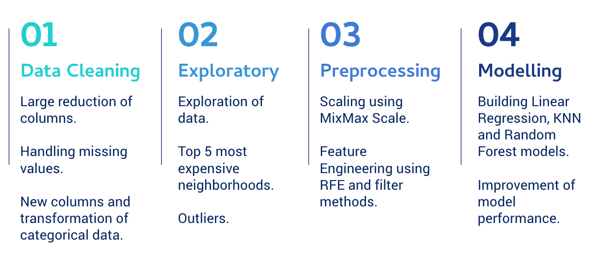
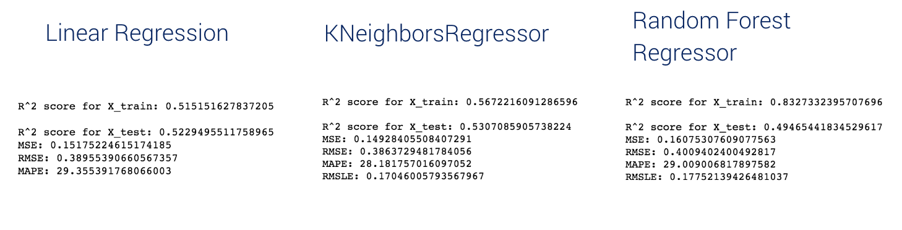

# supervised-learning
 The objective of this project is to build and iterate on different supervised learning algorithms. Once built, we shoudld compare the model performance using proper evaluation metrics.

 This project is about Airbnb listings in Paris. I used data scrapped from [insideairbnb.com](http://insideairbnb.com/) which gives many features on airbnb locations.

## Problem Definition
Let's say we would like to build a component to help customer predict the price per night of their future location. 

**Q: What would be the price per night for a given appartment located in Paris?**

## Process

**Tools and way of working:** I worked with Python on Jupiter Notebook. I first started to build a MVP with preprocessing methods and the three models. Then I worked to improve the performance of models playing on parameters.

## Python concepts used

Libraries:
- pandas 
- numpy
- matplotlib 
- seaborn 
- sklearn feature_selection, model_selection, linear_model, ensemble, neighbors, metrics

## Results

- Linear Regression and KNN performs better although global performance of models are not so good (R^2 score above 0.50)
- Finally, Linear Regression model assumptions are not met (Normality and still 0.23% of outliers)

## Challenges
- Poor performance from the beginning: linearity of the data and dependency between the features and the price are not strong
- Overfitting of models: playing on models parameters allowed to fix overfitting for KNN model

## Lessons learned
- Many possibilities for model improvements
- Importance of features 

## Possible improvements
- More precise data cleaning by using z-score to detect outliers and interpolate more missing values to keep other kind of feature
- Normalization of dataset to meet Linear Regression assumptions
- Try other preprocessing methods such as Sequential Selection or PCA to fix overfitting issues
- Try other models such as Lasso, XGBoost or Nayes Bayes

